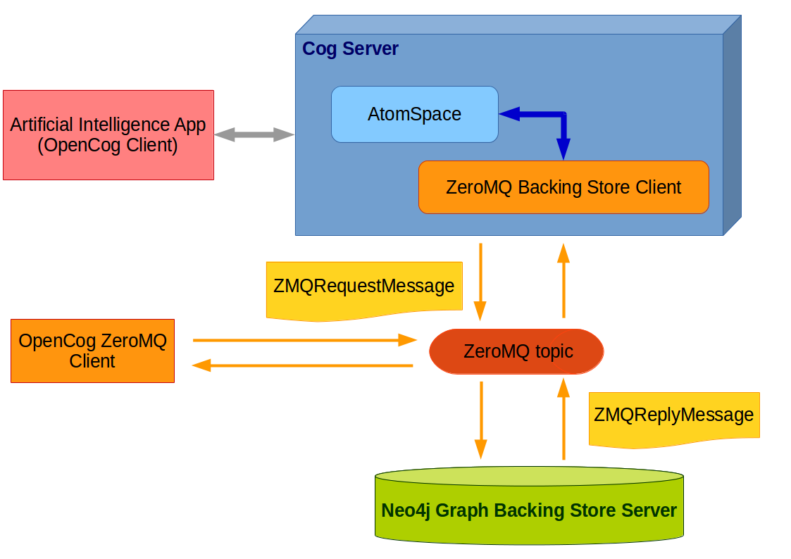

(Draft Paper to be submitted to [4th International Conference on Interactive Digital Media (ICIDM) 2015](http://icidm2015.seaconf.org/))

## Abstract

We create [a graph backing store](http://wiki.opencog.org/w/Neo4j_Backing_Store)[1] for [OpenCog](http://www.opencog.org/)[2, 3] using [Neo4j graph database](http://neo4.org/)[4]. The GraphBackingStore API extends the current BackingStore C++ API. It can take special queries that map naturally into Cypher queries and simple manipulations of Neo4j graph traversals.

The Neo4j node-relationship structures and custom indices are optimized for [AtomSpace](http://wiki.opencog.org/w/AtomSpace)[5] usage and performance, with considerations for integration with [Linked Data](http://linkeddata.org/)[17]. This makes it easier to integrate projects which use common Linked Data foundation, such as [Lumen Robot Friend](http://lumen.lskk.ee.itb.ac.id/)[29]. Data access is using [Protocol Buffers](https://developers.google.com/protocol-buffers/)-based[6] protocol over [ZeroMQ](http://www.zeromq.org/)[7] messaging transport.

The initial work for Neo4j Graph Backing Store for OpenCog was implemented during [Google Summer of Code 2015](https://www.google-melange.com/gsoc/proposal/review/student/google/gsoc2015/hendy/5629499534213120)[8]. All source code is open source and available at https://github.com/ceefour/opencog-neo4j, https://github.com/opencog/atomspace, and https://github.com/opencog/opencog.

## I. Introduction

OpenCog "[aims] to create an open source framework for Artificial General Intelligence, intended to one day express general intelligence at the human level and beyond."[9] OpenCog comprises of several integrated open source projects, with AtomSpace hypergraph knowledge representation system[5] and Cog Server as the most essential components. 

For persisting knowledge, AtomSpace uses a Backing Store implementation. The most mature Backing Store implementation for OpenCog is SQL Backing Store written by Linas Vepstas. As AtomSpace represents knowledge in a hypergraph structure, persisting AtomSpace knowledge in a graph database is expected to be more intuitive and more portable. The Google Summer of Code 2015 work[8] implemented initial work on the Neo4j Graph Backing Store for OpenCog. Neo4j was chosen due to its popularity, flexible structure, good performance, portability, open source license, and availability of commercial support if required.

## II. Basic Architecture

AtomSpace[5] is embedded within Cog Server, written in combination of C++, Python, and Scheme programming languages.
The AtomSpace accesses the Neo4j Backing Store via a ZeroMQ Backing Store implementation, which implements the AtomSpace C++ BackingStore API
using message patterns with Protocol Buffers serialization and transported via ZeroMQ.

The Neo4j Backing Store Server itself is implemented in Java and contains the Neo4j graph database service.
The Neo4j Backing Store Server listens and communicates with client(s) using the OpenCog ZeroMQ protocol,
which uses Protocol Buffers serialization and ZeroMQ message transport.
The primary client of Neo4j Backing Store Server is the ZeroMQ Backing Store implementation in AtomSpace.

## III. Data Model

### Atoms, Nodes, and Links

[Atoms](http://wiki.opencog.org/w/Atom) are the basic elements of knowledge in AtomSpace, an Atom "captures the notion of an atomic formula (or atom) in mathematical logic."[10]
All Atoms have a type, which inherit from either [Node](http://wiki.opencog.org/w/Node) or [Link](http://wiki.opencog.org/w/Link). The type of an Atom is immutable.

* **Nodes** are Atoms with names. The name and the type of a Node together determine a unique key.[11] The name of a Node is also immutable.
* **Links** are Atom types that connect other Atoms. A Link is uniquely defined by its type and its outgoing set, i.e., the set of Atoms linked by it.[12] The outgoing set of a Link is also immutable.

15 Node types supported out-of-the-box by AtomSpace are:

1. [`ConceptNode`](http://wiki.opencog.org/wikihome/index.php/ConceptNode)
2. [`NumberNode`](http://wiki.opencog.org/wikihome/index.php/NumberNode)
3. [`TypeNode`](http://wiki.opencog.org/wikihome/index.php/TypeNode)
4. [`TypeChoice`](http://wiki.opencog.org/wikihome/index.php/TypeChoice)
5. [`VariableNode`](http://wiki.opencog.org/wikihome/index.php/VariableNode)
6. [`VariableList`](http://wiki.opencog.org/wikihome/index.php/VariableList)
7. [`ProcedureNode`](http://wiki.opencog.org/wikihome/index.php/ProcedureNode)
8. [`GroundedProcedureNode`](http://wiki.opencog.org/wikihome/index.php/GroundedProcedureNode)
9. [`SchemaNode`](http://wiki.opencog.org/wikihome/index.php/SchemaNode)
10. [`DefinedSchemaNode`](http://wiki.opencog.org/wikihome/index.php/DefinedSchemaNode)
11. [`GroundedSchemaNode`](http://wiki.opencog.org/wikihome/index.php/GroundedSchemaNode)
12. [`PredicateNode`](http://wiki.opencog.org/wikihome/index.php/PredicateNode)
13. [`DefinedPredicateNode`](http://wiki.opencog.org/wikihome/index.php/DefinedPredicateNode)
14. [`GroundedPredicateNode`](http://wiki.opencog.org/wikihome/index.php/GroundedPredicateNode)
15. [`AnchorNode`](http://wiki.opencog.org/wikihome/index.php/AnchorNode)

57 Link types supported out-of-the-box by AtomSpace are:

1. [`OrderedLink`](http://wiki.opencog.org/wikihome/index.php/OrderedLink)
2. [`UnorderedLink`](http://wiki.opencog.org/wikihome/index.php/UnorderedLink)
3. [`SetLink`](http://wiki.opencog.org/wikihome/index.php/SetLink)
4. [`ListLink`](http://wiki.opencog.org/wikihome/index.php/ListLink)
5. [`MemberLink`](http://wiki.opencog.org/wikihome/index.php/MemberLink)
6. [`SubsetLink`](http://wiki.opencog.org/wikihome/index.php/SubsetLink)
7. [`IntensionalInheritanceLink`](http://wiki.opencog.org/wikihome/index.php/IntensionalInheritanceLink)
8. [`ExtensionalSimilarityLink`](http://wiki.opencog.org/wikihome/index.php/ExtensionalSimilarityLink)
9. [`IntensionalSimilartiyLink`](http://wiki.opencog.org/wikihome/index.php/IntensionalSimilarityLink)
10. [`AndLink`](http://wiki.opencog.org/wikihome/index.php/AndLink)
11. [`OrLink`](http://wiki.opencog.org/wikihome/index.php/OrLink)
12. [`NotLink`](http://wiki.opencog.org/wikihome/index.php/NotLink)
13. [`SequentialAndLink`](http://wiki.opencog.org/wikihome/index.php/SequentialAndLink)
14. [`AbsentLink`](http://wiki.opencog.org/wikihome/index.php/AbsentLink)
15. [`ChoiceLink`](http://wiki.opencog.org/wikihome/index.php/ChoiceLink)
16. [`PresentLink`](http://wiki.opencog.org/wikihome/index.php/PresentLink)
17. [`ContextLink`](http://wiki.opencog.org/wikihome/index.php/ContextLink)
18. [`TypedVariableLink`](http://wiki.opencog.org/wikihome/index.php/TypedVariableLink)
19. [`LambdaLink`](http://wiki.opencog.org/wikihome/index.php/LambdaLink)
20. [`DefineLink`](http://wiki.opencog.org/wikihome/index.php/DefineLink)
21. [`PutLink`](http://wiki.opencog.org/wikihome/index.php/PutLink)
22. [`PatternLink`](http://wiki.opencog.org/wikihome/index.php/PatternLink)
23. [`GetLink`](http://wiki.opencog.org/wikihome/index.php/GetLink)
24. [`SatisfactionLink`](http://wiki.opencog.org/wikihome/index.php/SatisfactionLink)
25. [`BindLink`](http://wiki.opencog.org/wikihome/index.php/BindLink)
26. [`QuoteLink`](http://wiki.opencog.org/wikihome/index.php/QuoteLink)
27. [`UnquoteLink`](http://wiki.opencog.org/wikihome/index.php/UnquoteLink)
28. [`ForallLink`](http://wiki.opencog.org/wikihome/index.php/ForallLink)
29. [`ExistsLink`](http://wiki.opencog.org/wikihome/index.php/ExistsLink)
30. [`AverageLink`](http://wiki.opencog.org/wikihome/index.php/AverageLink)
31. [`SatisfyingSetLink`](http://wiki.opencog.org/wikihome/index.php/SatisfyingSetLink)
32. [`ScholemLink`](http://wiki.opencog.org/wikihome/index.php/ScholemLink)
33. [`ImplicationLink`](http://wiki.opencog.org/wikihome/index.php/ImplicationLink)
34. [`EquivalenceLink`](http://wiki.opencog.org/wikihome/index.php/EquivalenceLink)
35. [`AssociativeLink`](http://wiki.opencog.org/wikihome/index.php/AssociativeLink)
36. [`InheritanceLink`](http://wiki.opencog.org/wikihome/index.php/InheritanceLink)
37. [`SimilarityLink`](http://wiki.opencog.org/wikihome/index.php/SimilarityLink)
38. [`AttractionLink`](http://wiki.opencog.org/wikihome/index.php/AttractionLink)
39. [`FreeLink`](http://wiki.opencog.org/wikihome/index.php/FreeLink)
40. [`EvaluationLink`](http://wiki.opencog.org/wikihome/index.php/EvaluationLink)
41. [`ExecutionLink`](http://wiki.opencog.org/wikihome/index.php/ExecutionLink)
42. [`SchemaExecutionLink`](http://wiki.opencog.org/wikihome/index.php/SchemaExecutionLink)
43. [`SchemaEvaluationLink`](http://wiki.opencog.org/wikihome/index.php/SchemaEvaluationLink)
44. [`QuantityLink`](http://wiki.opencog.org/wikihome/index.php/QuantityLink)
45. [`VirtualLink`](http://wiki.opencog.org/wikihome/index.php/VirtualLink)
46. [`GreaterThanLink`](http://wiki.opencog.org/wikihome/index.php/GreaterThanLink)
47. [`EqualLink`](http://wiki.opencog.org/wikihome/index.php/EqualLink)
48. [`FunctionLink`](http://wiki.opencog.org/wikihome/index.php/FunctionLink)
49. [`ExecutionOutputLink`](http://wiki.opencog.org/wikihome/index.php/ExecutionOutputLink)
50. [`FoldLink`](http://wiki.opencog.org/wikihome/index.php/FoldLink)
51. [`ArithmeticLink`](http://wiki.opencog.org/wikihome/index.php/ArithmeticLink)
52. [`PlusLink`](http://wiki.opencog.org/wikihome/index.php/PlusLink)
53. [`TimesLink`](http://wiki.opencog.org/wikihome/index.php/TimesLink)
54. [`DeleteLink`](http://wiki.opencog.org/wikihome/index.php/DeleteLink)
55. [`AssignLink`](http://wiki.opencog.org/wikihome/index.php/AssignLink)
56. [`InsertLink`](http://wiki.opencog.org/wikihome/index.php/InsertLink)
57. [`RemoveLink`](http://wiki.opencog.org/wikihome/index.php/RemoveLink)

### Truth Values

A truth value gives each Atom a valuation or an interpretation; thus all Atoms in a given, fixed AtomSpace always carry a default valuation/interpretation along with them.[10] All truth values expose at least two parameters describing truth:[13]

1. **Strength**, a floating-point value ranging from 0 to 1, with 0 denoting the classical `Boolean` `false`, and 1.0 denoting `true`.
2. **Confidence**, a floating point value ranging from 0 to 1, expressing the certainty of the strength, with 0 denoting completely uncertain, and 1 denoting completely confident.

Currently, OpenCog supports 7 types of truth values:

1. `SimpleTruthValue`. Holds two floating-point values, commonly called "strength" and "confidence".
2. `CountTruthValue`. Holds three floating point values. One is typically a raw count (integer) of having seen some event. Another is typically the logarithm of the normalized frequency (i.e. observed probability) of the event.
3. `IndefiniteTruthValue`. Holds four floating point numbers.
4. `FuzzyTruthValue`. Fuzzy truth value.
5. `GenericTruthValue`. Generic truth value.
6. `NullTruthValue`. A special type of truth value.
7. `ProbabilisticTruthValue`. A truth value that stores a mean, a confidence and the number of observations.

### AtomSpace

AtomSpace is an essential component of OpenCog, "an API for storing and querying hypergraphs, and is the central Knowledge Representation system provided by the OpenCog Framework. The hypergraphs stored in the AtomSpace consist of Atoms (the superclass for Nodes and Links)."[5]

### Scheme Representation

[Scheme](https://en.wikipedia.org/wiki/Scheme_(programming_language)) is a principal dialect of the computer programming language Lisp. Scheme follows a minimalist design philosophy that specifies a small standard core accompanied by powerful tools for language extension, this is in contrast to Common Lisp which has a relatively richer "core".[14]

[Scheme is used by OpenCog](http://wiki.opencog.org/w/Scheme) in many places to represent Atoms,[15] for example a simple `ConceptNode`:

    (ConceptNode "tree")

A `ConceptNode` with a `SimpleTruthValue`:

    (ConceptNode (stv 0.9 0.2) "tree")

A `ReferenceLink` with a `SimpleTruthValue`:

    (ReferenceLink (stv 0.987 0.234)
      (ConceptNode "dog-instance-1") (WordNode "dog"))

OpenCog's Scheme notation makes it easier to represent and understand simple to moderately
complex Atom relationships.

### Backing Store

AtomSpace works mainly in-memory. It supports persisting Atoms to permanent storage
via Backing Store mechanism. AtomSpace supports [5 Backing Store implementations](https://github.com/opencog/atomspace/blob/master/opencog/persist/README)[16] in various states:

1. `file`. File-based storage. Works, but deprecated.
2. `hypertable`. Experimental HyperTable support. Unmaintained. (Won't compile at this time.)
3. `memcache`. Experimental/broken, uses memcached for persistence. (Won't compile at this time.)
4. `sql`. Works well for most uses -- with caveats.
5. `zmq`. ZeroMQ-based AtomSpace serialization and deserialization. This is the Backing Store implementation that is used with the Neo4j Graph Backing Store Server.

## IV. Neo4j Graph Model Mapping

The AtomSpace hypergraph model and Neo4j graph model have many similarities. However, we still needed to map particular AtomSpace concepts to their representation in Neo4j.

### Vertex Labels

OpenCog Neo4j Graph Backing Store represents all `Node`s as graph vertices, and also by default represents `Link`s as graph vertices. The Atom types are mapped one-to-one to Neo4j vertex labels. By default, Atom types are mapped to a vertex label prefixed with `opencog_`, e.g., `WordNode` maps to `opencog_WordNode`.

Neo4j allows graph vertices to have labels. While multiple labels are possible, OpenCog Neo4j Graph Backing Store only uses one label for each vertex.

### Edge Types

Neo4j Backing Store differs between binary `Link`s and n-ary `Link`. For binary `Link`s, edge types are:

1. `rdf_subject`. Edge that connects to the first element of the outgoing set.
2. `rdf_object`. Edge that connects to the second/last element of the outgoing set.

For n-ary `Links`, Neo4j Backing Store uses these edge types:

1. `opencog_predicate`. Only used by `PredicateLink`, this connects the `PredicateLink` to the `PredicateNode`.
2. `opencog_parameter`. This connects the `Link` to each element of the outgoing set. In case of `PredicateLink`, the first outgoing edge to `PredicateNode` is excluded. Each edge has an integer `position` property which specifies the parameter index of the outgoing set (starting from 0).

### Linked Data, RDF, Schema.org, and YAGO Integration

The structure and naming of the vertices, edges, and properties of the OpenCog Neo4j graph database are designed to facilitate integration with [Linked Data](http://linkeddata.org/)[17] technologies, with special considerations for [Resource Description Framework (RDF)](http://www.w3.org/RDF/)[18], [Schema.org](http://schema.org/)[19], and [YAGO](http://www.mpi-inf.mpg.de/departments/databases-and-information-systems/research/yago-naga/yago/)[20] ontologies.

The following table lists the Linked Data-friendly Neo4j vertex labels to represent AtomSpace knowledge base:

| **Atom type**   | **Linked Data URI**                             | **Vertex label**| **Ontology**                                               |
|-----------------|-------------------------------------------------|-----------------|----------------------------------------------------------------|
| `ConceptNode`     | http://schema.org/Thing                         | `schema_Thing`    | [Schema.org](http://schema.org/)                               |
| `InheritanceLink` | http://www.w3.org/2000/01/rdf-schema#subClassOf | `rdfs_subClassOf` | [Resource Description Framework (RDF)](http://www.w3.org/RDF/) |
| `MemberLink`      | http://www.w3.org/1999/02/22-rdf-syntax-ns#type | `rdf_type`        | [Resource Description Framework (RDF)](http://www.w3.org/RDF/) |

The Neo4j edge types for binary `Link`s use reuse Linked Data properties from [Resource Description Framework (RDF)](http://www.w3.org/RDF/):

| **Description**   | **Linked Data URI**                             | **Edge type**| **Ontology**                                               |
|-----------------|-------------------------------------------------|-----------------|----------------------------------------------------------------|
| First outgoing element of binary `Link` | http://www.w3.org/1999/02/22-rdf-syntax-ns#subject | `rdf_subject` | [Resource Description Framework (RDF)](http://www.w3.org/RDF/) |
| Second outgoing element of binary `Link` | http://www.w3.org/1999/02/22-rdf-syntax-ns#object | `rdf_object`        | [Resource Description Framework (RDF)](http://www.w3.org/RDF/) |

The vertex and edge properties used by OpenCog Neo4j Graph Backing Store are designed to interoperate with Linked Data technologies:

| **Property**   | **Description**          | **Linked Data URI**                             | **Ontology**                                               |
|-----------------|-------------------------------------------------|-----------------|----------------------------------------------------------------|
| `nn` | Node name or [Linked Data QName](https://en.wikipedia.org/wiki/QName)[21] | http://www.w3.org/1999/02/22-rdf-syntax-ns#about | [Resource Description Framework (RDF)](http://www.w3.org/RDF/) |
| `prefLabel` | Preferred label | http://yago-knowledge.org/resource/prefLabel | [YAGO](http://www.mpi-inf.mpg.de/departments/databases-and-information-systems/research/yago-naga/yago/) |
| `isPreferredMeaningOf` | Indicates the `Node` is the preferred meaning of specified textual label | http://yago-knowledge.org/resource/isPreferredMeaningOf |  [YAGO](http://www.mpi-inf.mpg.de/departments/databases-and-information-systems/research/yago-naga/yago/) |
| `tv` | Generic truth value (array of floating-point values) | | |

### Indexing

Neo4j already has excellent graph traversal performance.
To provide faster lookup performance, all graph vertices are also indexed.

| **Property**   | **Index type**          |
|-----------------|-------------------------------------------------|
| `nn` | Unique constraint |
| `prefLabel` | Index |
| `isPreferredMeaningOf` | Index |

## V. Data Access Protocol

While Neo4j Server provides a REST/HTTP endpoint out-of-the-box, AtomSpace operations may require better performance by reducing serialization overhead, and also to prepare for asynchronous/event-based functionality. Therefore, the Neo4j Graph Backing Store Server supports the OpenCog Protocol which uses the ZeroMQ transport and Protocol Buffers serialization.

### ZeroMQ

[ZeroMQ](http://www.zeromq.org/)[7] transport layer is used to communicate between Neo4j Graph Backing Store Server and its clients.
The primary client is the OpenCog Server.

ZeroMQ has several attractive features:

1. Supports multiple languages and platforms.
2. Carries messages across inproc, IPC, TCP, TIPC, multicast.
3. Smart patterns like pub-sub, push-pull, and router-dealer.
4. High-speed asynchronous I/O engines, in a tiny library.
5. Backed by a large and active open source community.
6. Architectural flexibility: centralized, distributed, small, or large.
7. Free software with full commercial support.

### Protocol Buffers (Protobuf)

OpenCog Protocol serializes messages using [Protocol Buffers](https://developers.google.com/protocol-buffers/)[6], a language-neutral, platform-neutral extensible mechanism for serializing structured data.

The following table lists the core data structures of the [OpenCog Protobuf serialization](https://github.com/opencog/atomspace/blob/master/opencog/persist/zmq/atomspace/ZMQMessages.proto)[22]:

| **Name**   | **Type**          |
|-----------------|-------------------------------------------------|
| `ZMQAttentionValueHolderMessage` | Message |
| `ZMQTruthValueType` | Enumeration |
| `ZMQVersionHandleMessage` | Message |
| `ZMQSingleTruthValueMessage` | Message |
| `ZMQTruthValueMessage` | Message |
| `ZMQTrailMessage` | Message |
| `ZMQAtomType` | Enumeration |
| `ZMQAtomMessage` | Message |
| `ZMQAtomFetchKind` | Enumeration |
| `ZMQAtomFetch` | Message |
| `ZMQFunctionType` | Enumeration |
| `ZMQAtomTypeInfo` | Message |
| `ZMQRequestMessage` | Message |
| `ZMQReplyMessage` | Message |

### Functions

In a ZeroMQ message, the client can request a particular function of the OpenCog Neo4j Backing Store Server.
It is planned to expand these functions to optimize more OpenCog graph operations.
The currently supported functions are listed the following table.

| **Function**   | **Description**          |
|-----------------|-------------------------------------------------|
| `ZMQgetAtom` | Get a single atom by handle UUID. |
| `ZMQgetName` | Get name of a node. |
| `ZMQgetAtoms` | Get multiple atoms by UUID, atomType + node name, or atomType + outgoing set. |
| `ZMQstoreAtoms` | Store multiple atoms by atomType + node name (for node), or atomType + outgoing set (for link). |

## VI. Clients

OpenCog Neo4j Backing Store Server exposes its functionality through the ZeroMQ-based OpenCog Protocol,
which means any client can access it through the appropriate messages. The primary client for OpenCog Neo4j Backing Store Server
is the OpenCog Server.

### OpenCog Server

OpenCog Server is the primary software which contains the OpenCog Artificial General Intelligence and the AtomSpace knowledge hypergraph.
AtomSpace hypergraph can be loaded from and persisted to Neo4j using [appropriate Scheme commands](https://github.com/ceefour/opencog/blob/persist-zmq/opencog/modules/PersistZmqModule.h)[23].
These commands allow AtomSpace to integrate with Neo4j Backing Store Server using OpenCog ZeroMQ Protocol. The supported commands are listed
in the table below.

| **Command**   | **Description**          |
|-----------------|-------------------------------------------------|
| `zmq-close` | Close the currently open ZeroMQ persistence. |
| `zmq-load` | Load contents of ZeroMQ persistence. |
| `zmq-open` | Open connection to ZeroMQ persistence. |
| `zmq-store` | Save the atomtable on the ZeroMQ persistence. |

### Java Command Line Interface (CLI) Client

A Java-based Command Line Interface (CLI) client is also available for ad-hoc testing of the Neo4j Graph Backing Store Server
or any backing store supporting the OpenCog ZeroMQ Protocol.

## VII. Deployment

A typical deployment of an OpenCog application with the Neo4j Graph Backing Store requires the following components:

1. A modern Linux distribution such as [Ubuntu](http://www.ubuntu.com/)[24] or [Linux Mint](http://linuxmint.com/)[25]. Parts of OpenCog are written in fully portable languages such as [Java](https://en.wikipedia.org/wiki/Java_(programming_language)), [Python](https://www.python.org/), and [Scheme](https://en.wikipedia.org/wiki/Scheme_(programming_language))[14]. However, there are parts which require libraries which are only readily available in Linux operating systems.
2. OpenCog Server. The OpenCog server can be built from three Git project repositories: `cogutils`, `atomspace`, and `opencog`.
3. Neo4j Backing Store Server. This server is implemented entirely in Java and can run in any operating system supported by the Java Runtime Engine (JRE), such as Windows, Linux, and Mac OS X.
4. High-level Application. While not strictly required, a separate application can be deployed which utilizes the artificial intelligence capabilities
   of OpenCog. The application can communicate with OpenCog Server via either the low-level `cogserver` Scheme shell at port 17001, or
   via the OpenCog ZeroMQ Protocol.

## VIII. Related Work

Various papers have been publicized which describes the OpenCog Framework and its components. Some which are particularly related to AtomSpace are:

1. [A Software Architecture for Generally Intelligent Humanoid Robotics.](http://www.sciencedirect.com/science/article/pii/S1877050914015440)[26]
2. [Toward a Robust Software Architecture for Generally Intelligent Humanoid Robotics.](http://goertzel.org/ICRA_humanoid_goertzel_v1.pdf)[27]
3. [The OpenCog Framework.](http://link.springer.com/chapter/10.2991/978-94-6239-030-0_1)[28]

## IX. Conclusion

OpenCog Framework is a mature and comprehensive Artificial General Intelligence (AGI) framework which is open source and can be used for
various purposes, including humanoid robotics, natural language processing, and probabilistic reasoning. AtomSpace, an essential part of OpenCog,
provides the knowledge hypergraph which allows individual artificial intelligence modules to integrate and manipulate knowledge in a uniform way
and using common metamodel. OpenCog Neo4j Graph Backing Store enhances this functionality by providing persisted storage of the AtomSpace knowledge
in a graph database which has very similar structure to AtomSpace. By supporting a platform-agnostic ZeroMQ-based protocol,
OpenCog Neo4j Graph Backing Store opens potential uses cases of integration with intelligent applications. OpenCog Neo4j Graph Backing Store also
maps well to Linked Data technologies, especially reusing Resource Description Framework (RDF), Schema.org, and YAGO ontologies. This is an elaborate design to ease collaboration with other researchers and the technology industry players, particularly from the Linked Data community, YAGO researchers, Artificial Intelligence community, and [Lumen Robot Friend](http://lumen.lskk.ee.itb.ac.id/)[29] researchers.

## X. Acknowledgements

We would like to thank OpenCog Foundation mentors especially [Linas Vepstas](http://linas.org/), [Amen Belayneh](https://www.linkedin.com/in/amenbelayneh), and [Ben Goertzel](http://goertzel.org/), without whose great efforts we could not have built Neo4j Graph Backing Store for OpenCog. We thank [Fabian Suchanek](https://suchanek.name/) and his team for their excellent work on [YAGO Semantic Knowledge Base](http://www.mpi-inf.mpg.de/departments/databases-and-information-systems/research/yago-naga/yago/)[20]. We also thank all former, current, and newer [Lumen Robot Friend](http://lumen.lskk.ee.itb.ac.id/)[29] team members, including [Budhi Yulianto](https://www.linkedin.com/pub/budhi-yulianto/26/885/256) who researched Graph Database for Lumen Robot Friend, [Marzuki Syahfirin](https://onemarzuki.wordpress.com/) as coordinator of Lumen Robot Friend, [Maria Shusanti](https://www.facebook.com/maria.shusanti) for Lumen Robot Friend gesture research, [Wahyudi](https://www.facebook.com/wahyudi.si) for natural language understanding research, [Sigit Ari Wijanarko](https://www.facebook.com/sigit.ariw) for researching Lumen Robot Friend augmented reality visualization, [Taufiq Nuzwir Nizar](https://independent.academia.edu/TaufiqNizar) for image processing algorithms, [Ahmad Syarif](https://itb.academia.edu/AhmadSyarif) for [NAO](https://www.aldebaran.com/en/humanoid-robot/nao-robot) avatar integration, [Putri Nhirun](https://www.researchgate.net/profile/Putri_Nhirun) for Lumen speech capabilities, [Setyaki Sholata Sya](https://itb.academia.edu/SetyakiSholataSya) for Lumen visual recognition.

## XI. References

1. OpenCog Foundation. Neo4j Graph Backing Store. http://wiki.opencog.org/w/Neo4j_Backing_Store.
2. OpenCog Foundation. OpenCog website. http://www.opencog.org/.
3. [Hart, David, and Ben Goertzel. "Opencog: A software framework for integrative artificial general intelligence." _Frontiers in Artificial Intelligence and Applications_ 171 (2008): 468.](https://books.google.co.id/books?id=atjvAgAAQBAJ&lpg=PA468&ots=9GT02Qu2jO&dq=opencog&lr&pg=PA468#v=onepage&q=opencog&f=false)
4. Neo4j. Neo4j Graph Database. http://neo4.org/.
5. OpenCog Foundation. AtomSpace. http://wiki.opencog.org/w/AtomSpace.
6. Google, Inc. Protocol Buffers. https://developers.google.com/protocol-buffers/.
7. ZeroMQ. ZeroMQ. http://www.zeromq.org/
8. Irawan, Hendy. Proposal for Google Summer of Code 2015. https://www.google-melange.com/gsoc/proposal/review/student/google/gsoc2015/hendy/5629499534213120
9. OpenCog Foundation. OpenCog. http://wiki.opencog.org/w/The_Open_Cognition_Project.
10. OpenCog Foundation. Atom. http://wiki.opencog.org/w/Atom.
11. OpenCog Foundation. Node. http://wiki.opencog.org/w/Node.
12. OpenCog Foundation. Link. http://wiki.opencog.org/w/Link.
13. OpenCog Foundation. Truth Value. http://wiki.opencog.org/w/TruthValue.
14. Wikipedia. Scheme (programming language). https://en.wikipedia.org/wiki/Scheme_(programming_language).
15. OpenCog Foundation. Scheme. http://wiki.opencog.org/w/Scheme.
16. OpenCog Foundation. `atomspace/opencog/persist/README`. https://github.com/opencog/atomspace/blob/master/opencog/persist/README.
17. Linked Data Community. Linked Data. http://linkeddata.org/.
18. RDF Working Group. Resource Description Framework (RDF). http://www.w3.org/RDF/.
19. W3C Schema.org Community Group. Schema.org. http://schema.org/.
20. Max Planck Institute for Informatics. YAGO: A High-Quality Knowledge Base. http://www.mpi-inf.mpg.de/departments/databases-and-information-systems/research/yago-naga/yago/.
21. Wikipedia. QName. https://en.wikipedia.org/wiki/QName.
22. OpenCog Foundation. `atomspace/opencog/persist/zmq/atomspace/ZMQMessages.proto`. https://github.com/opencog/atomspace/blob/master/opencog/persist/zmq/atomspace/ZMQMessages.proto.
23. OpenCog Foundation. `opencog/opencog/modules/PersistZmqModule.h`. https://github.com/ceefour/opencog/blob/persist-zmq/opencog/modules/PersistZmqModule.h.
24. Canonical. Ubuntu. http://www.ubuntu.com/.
25. Linux Mint. Linux Mint. http://linuxmint.com/.
26. Goertzel, Ben, David Hanson, and Gino Yu. "A Software Architecture for Generally Intelligent Humanoid Robotics." Procedia Computer Science 41 (2014): 158-163. http://www.sciencedirect.com/science/article/pii/S1877050914015440.
27. Goertzel, Ben, David Hanson, and Gino Yu. "Toward a Robust Software Architecture for Generally Intelligent Humanoid Robotics." http://goertzel.org/ICRA_humanoid_goertzel_v1.pdf
28. Goertzel, Ben, Cassio Pennachin, and Nil Geisweiller. "The OpenCog Framework." Engineering General Intelligence, Part 2. Atlantis Press, 2014. 3-29. http://link.springer.com/chapter/10.2991/978-94-6239-030-0_1
29. Control Systems and Computer Laboratory Bandung Institute of Technology (LSKK ITB). Lumen Social Robot. http://lumen.lskk.ee.itb.ac.id/
